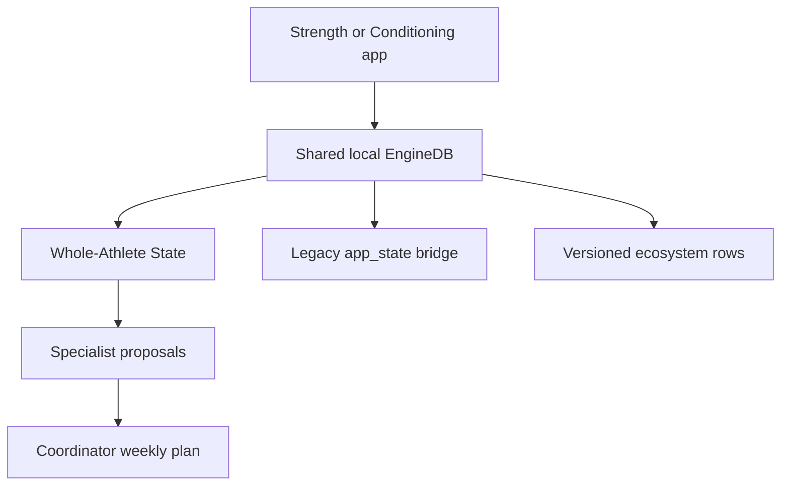

# Fitness Ecosystem rebuild status

Updated 2026-08-04.

## Implemented in this rebuild

| Boundary | Implementation |
|---|---|
| Shared facts | `packages/shared-core` with bounded sanitisation, legacy Settings migration, event vocabulary and per-domain namespace merge rules |
| Recovery/life context | `packages/whole-athlete-state`; sleep, soreness, energy, stress, physical load, illness, pain flags, training density, data quality and advisory HRV |
| Strength | `packages/strength-engine`; Strength proposal adapter plus existing lift/progression functions |
| Conditioning | `packages/conditioning-engine`; Conditioning proposal adapter plus existing cardio/progression functions |
| Coordination | `packages/coordinator`; deterministic placement, spacing, interference, caps, safety decisions and reason codes |
| App projection | `packages/coordinator-adapter`; both apps expose a Coordinated week summary |
| Local persistence | `EngineDB.core` and `EngineDB.ecosystem`, with load-time migration and merge-safe network sanitisation |
| Server boundary | RLS/revision/idempotency migration in `supabase/migrations/20260804_fitness_ecosystem_contracts.sql` |
| Product builds | Web `build:strength` / `build:conditioning`; Expo Conditioning EAS profiles and product-specific bundle identifiers |
| Manual inputs | Settings check-in for sleep, energy, soreness, stress, physical load, time, pain and illness |
| WHOOP | HRV, resting HR and sleep performance are persisted in the new core namespace; HRV remains advisory only |

## Rollout shape



The new ecosystem sync adapter is deliberately feature-gated. This allows a
staging migration and old-client compatibility rehearsal before a public app
starts writing the new tables. The old blob remains dual-written during the
transition; it is not silently removed.

## Product build profiles

Web:

```bash
pnpm --filter @hybrid/web build:strength
pnpm --filter @hybrid/web build:conditioning
```

The web profile changes the PWA name/manifest and output directory. The source
still shares UI while the domain packages and sync boundaries are being
separated; the next release hardening phase can remove non-owned screens from
each profile after canary evidence is collected.

Mobile:

```bash
pnpm --filter @hybrid/mobile build:apk
pnpm --filter @hybrid/mobile build:conditioning:apk
pnpm --filter @hybrid/mobile build:aab
pnpm --filter @hybrid/mobile build:conditioning:aab
```

The Conditioning profiles use a distinct Android package and iOS bundle
identifier. Set `EXPO_PUBLIC_CONDITIONING_EAS_PROJECT_ID` after creating the
separate EAS project and credentials; without it the dynamic config refuses to
reuse the Strength project's id. This repository does not invent credentials.

## Deliberate boundaries and remaining release work

- Nutrition remains a separate product. This repository defines integration
  event names but does not prescribe calories, macros or food targets.
- The new Supabase migration is not applied by local TypeScript tests. Apply it
  in a staging project, run RLS and old-version compatibility tests, then set
  the ecosystem sync feature flag.
- The production store split still needs device testing for BLE, GPS,
  Concept2, permissions, deep links, app deletion/reinstall and rollback.
- A Coordinator service or approved canonical writer must own persisted weekly
  plans before client-side plan publishing is enabled in production.
